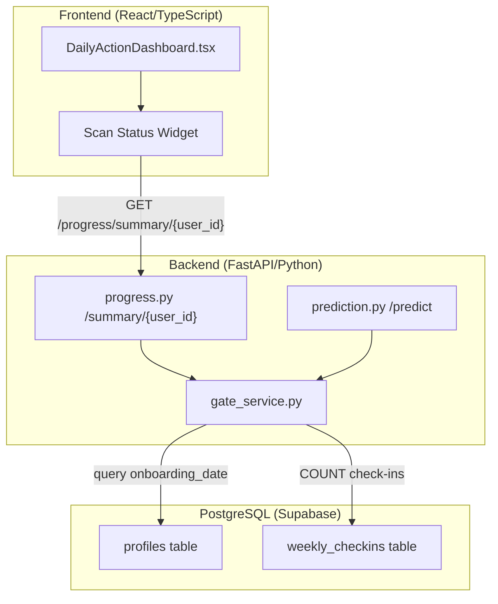
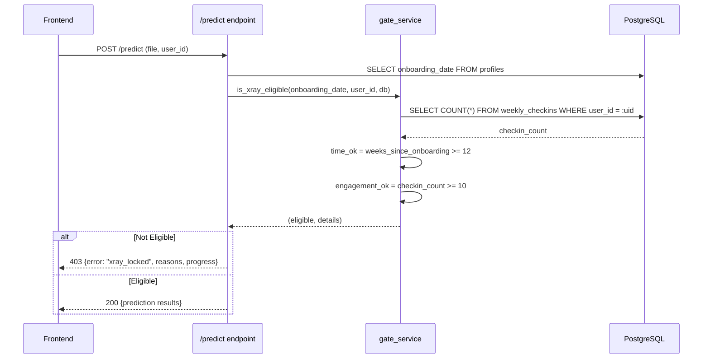
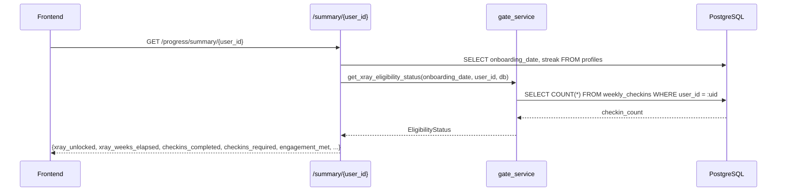

# Design Document: Scan Engagement Gate

## Overview

The Scan Engagement Gate adds a second eligibility condition to the follow-up X-ray scan unlock logic in SteadyGerak. Currently, scan eligibility is determined solely by time elapsed (≥12 weeks since onboarding). This feature introduces an engagement requirement: the user must have completed at least 10 out of 12 weekly check-ins before the scan becomes available.

Both conditions must be satisfied simultaneously — time elapsed ≥ 12 weeks AND completed check-ins ≥ 10 — forming a dual-gate that ensures users are actively participating in their rehabilitation program before receiving their next diagnostic scan. The "Days to Scan" dashboard widget will be updated to reflect both conditions, providing transparent feedback on what the user still needs to accomplish.

## Architecture



## Sequence Diagrams

### Scan Eligibility Check (Backend Gate)



### Dashboard Summary with Engagement Data



## Components and Interfaces

### Component 1: Gate Service (Backend)

**Purpose**: Centralized eligibility logic that evaluates both time and engagement conditions for X-ray scan access.

**Interface**:
```python
from dataclasses import dataclass
from datetime import datetime
from sqlalchemy.orm import Session

@dataclass
class XrayEligibilityStatus:
    eligible: bool
    time_eligible: bool
    engagement_eligible: bool
    weeks_elapsed: float
    weeks_remaining: float
    checkins_completed: int
    checkins_required: int
    checkins_remaining: int

def get_xray_eligibility_status(
    onboarding_date: datetime,
    user_id: str,
    db: Session
) -> XrayEligibilityStatus:
    """Evaluates both time and engagement conditions for X-ray eligibility."""
    ...

def is_xray_eligible(
    onboarding_date: datetime,
    user_id: str,
    db: Session
) -> bool:
    """Returns True only when BOTH time >= 12 weeks AND checkins >= 10."""
    ...

def get_checkin_count(user_id: str, db: Session) -> int:
    """Returns the total number of completed weekly check-ins for a user."""
    ...
```

**Responsibilities**:
- Query the `weekly_checkins` table to count completed check-ins
- Evaluate the time condition (weeks since onboarding ≥ 12)
- Evaluate the engagement condition (check-in count ≥ 10)
- Return a structured eligibility status with both conditions' details

### Component 2: Progress Router (Backend)

**Purpose**: Serves the dashboard summary endpoint with expanded eligibility information.

**Interface**:
```python
@router.get("/summary/{user_id}")
def get_summary(user_id: str, db: Session = Depends(get_db)) -> dict:
    """
    Returns dashboard summary including dual-gate eligibility status.
    
    Response includes:
        - xray_unlocked: bool (True only if both gates pass)
        - xray_weeks_elapsed: float
        - xray_weeks_remaining: float
        - xray_checkins_completed: int
        - xray_checkins_required: int (always 10)
        - xray_engagement_met: bool
        - xray_time_met: bool
    """
    ...
```

**Responsibilities**:
- Call `get_xray_eligibility_status()` from gate service
- Include engagement metrics in the summary response
- Maintain backward compatibility with existing response fields

### Component 3: Prediction Router (Backend)

**Purpose**: Guards the X-ray upload endpoint using the updated dual-gate logic.

**Interface**:
```python
@router.post("/predict")
async def predict(
    file: UploadFile = File(...),
    user_id: str = Form(None),
    db: Session = Depends(get_db)
) -> dict:
    """
    Upload endpoint that rejects requests when dual-gate is not satisfied.
    Returns detailed 403 with both conditions' status when locked.
    """
    ...
```

**Responsibilities**:
- Pass `user_id` and `db` to the updated `is_xray_eligible()` function
- Return a detailed 403 error showing which conditions are not met
- Include progress information so the frontend can display specific guidance

### Component 4: Scan Status Widget (Frontend)

**Purpose**: Displays dual-gate progress on the dashboard, replacing the pure time-based countdown.

**Interface**:
```typescript
interface ScanEligibilityData {
  xray_unlocked: boolean;
  xray_weeks_elapsed: number;
  xray_weeks_remaining: number;
  xray_checkins_completed: number;
  xray_checkins_required: number;
  xray_engagement_met: boolean;
  xray_time_met: boolean;
}

// Widget shows:
// 1. Time progress (circular countdown, same as before)
// 2. Check-in progress (e.g., "8/10 check-ins completed")
// 3. Clear status indicator for each condition
// 4. What action is needed to unlock the scan
```

**Responsibilities**:
- Fetch eligibility data from `/progress/summary/{user_id}`
- Display time countdown (existing circular progress)
- Display check-in progress bar or count
- Show clear unlock status for each condition
- Communicate what the user needs to do next

## Data Models

### Existing: `weekly_checkins` Table

```sql
CREATE TABLE weekly_checkins (
    id UUID PRIMARY KEY DEFAULT gen_random_uuid(),
    user_id UUID REFERENCES profiles(id),
    check_in_week_number INT NOT NULL,
    week_start_date DATE,
    current_pain_level INT,          -- 0-10
    current_stiffness_level INT,     -- 1-3
    composite_mobility_score INT,
    notes TEXT,
    created_at TIMESTAMPTZ DEFAULT NOW(),
    UNIQUE(user_id, check_in_week_number)
);
```

**No schema changes required** — the existing `weekly_checkins` table already stores one row per completed check-in with `(user_id, check_in_week_number)` as a unique constraint. The engagement gate simply counts rows in this table.

### Model: XrayEligibilityStatus (Python)

```python
from dataclasses import dataclass

@dataclass
class XrayEligibilityStatus:
    eligible: bool               # True only if both conditions met
    time_eligible: bool          # weeks_elapsed >= 12
    engagement_eligible: bool    # checkins_completed >= REQUIRED_CHECKINS
    weeks_elapsed: float         # fractional weeks since onboarding
    weeks_remaining: float       # max(0, 12 - weeks_elapsed)
    checkins_completed: int      # count of rows in weekly_checkins
    checkins_required: int       # constant: 10
    checkins_remaining: int      # max(0, 10 - checkins_completed)
```

**Validation Rules**:
- `weeks_elapsed` ≥ 0 (cannot be negative)
- `checkins_completed` ∈ [0, 12] (bounded by 12-week cycle)
- `checkins_required` = 10 (constant, could be made configurable)
- `eligible` = `time_eligible AND engagement_eligible`

### Model: Summary API Response Extension

```typescript
interface ProgressSummaryResponse {
  // Existing fields (unchanged)
  xp: number;
  streak_current: number;
  chart_unlocked: boolean;
  chart_days_remaining: number;
  xray_unlocked: boolean;
  xray_weeks_elapsed: number;
  xray_weeks_remaining: number;
  pain_chart: { pain_level: number; week: number }[];
  
  // New fields
  xray_checkins_completed: number;
  xray_checkins_required: number;
  xray_engagement_met: boolean;
  xray_time_met: boolean;
}
```

## Algorithmic Pseudocode

### Main Eligibility Algorithm

```python
CONSTANTS:
    REQUIRED_WEEKS = 12
    REQUIRED_CHECKINS = 10

def get_xray_eligibility_status(onboarding_date, user_id, db):
    """
    INPUT: onboarding_date (datetime), user_id (str), db (Session)
    OUTPUT: XrayEligibilityStatus
    
    PRECONDITIONS:
        - onboarding_date is not None and is a valid datetime
        - user_id is a valid UUID string referencing an existing profile
        - db is an active database session
    
    POSTCONDITIONS:
        - result.eligible == (result.time_eligible AND result.engagement_eligible)
        - result.weeks_elapsed >= 0
        - result.checkins_completed >= 0
        - result.checkins_remaining == max(0, REQUIRED_CHECKINS - result.checkins_completed)
        - result.weeks_remaining == max(0, REQUIRED_WEEKS - result.weeks_elapsed)
    """
    
    # Step 1: Evaluate time condition
    weeks_elapsed = weeks_since_onboarding(onboarding_date)
    time_eligible = weeks_elapsed >= REQUIRED_WEEKS
    weeks_remaining = max(0.0, REQUIRED_WEEKS - weeks_elapsed)
    
    # Step 2: Evaluate engagement condition
    checkins_completed = get_checkin_count(user_id, db)
    engagement_eligible = checkins_completed >= REQUIRED_CHECKINS
    checkins_remaining = max(0, REQUIRED_CHECKINS - checkins_completed)
    
    # Step 3: Combine conditions (AND gate)
    eligible = time_eligible and engagement_eligible
    
    return XrayEligibilityStatus(
        eligible=eligible,
        time_eligible=time_eligible,
        engagement_eligible=engagement_eligible,
        weeks_elapsed=round(weeks_elapsed, 1),
        weeks_remaining=round(weeks_remaining, 1),
        checkins_completed=checkins_completed,
        checkins_required=REQUIRED_CHECKINS,
        checkins_remaining=checkins_remaining
    )
```

### Check-in Count Query

```python
def get_checkin_count(user_id, db):
    """
    INPUT: user_id (str), db (Session)
    OUTPUT: int (number of completed check-ins)
    
    PRECONDITIONS:
        - user_id is a valid UUID
        - db is an active session
    
    POSTCONDITIONS:
        - result >= 0
        - result <= 12 (bounded by weekly cycle)
    """
    
    result = db.execute(
        text("SELECT COUNT(*) FROM weekly_checkins WHERE user_id = :uid"),
        {"uid": user_id}
    ).scalar()
    
    return result or 0
```

### Updated is_xray_eligible (Breaking Change - New Signature)

```python
def is_xray_eligible(onboarding_date, user_id, db):
    """
    INPUT: onboarding_date (datetime), user_id (str), db (Session)
    OUTPUT: bool
    
    PRECONDITIONS:
        - onboarding_date is a valid datetime
        - user_id references an existing user
        - db is active
    
    POSTCONDITIONS:
        - Returns True IFF weeks_since_onboarding >= 12 AND checkin_count >= 10
    
    NOTE: Signature changes from (onboarding_date) to (onboarding_date, user_id, db)
          All callers must be updated.
    """
    
    status = get_xray_eligibility_status(onboarding_date, user_id, db)
    return status.eligible
```

## Key Functions with Formal Specifications

### Function 1: `get_xray_eligibility_status()`

```python
def get_xray_eligibility_status(
    onboarding_date: datetime,
    user_id: str,
    db: Session
) -> XrayEligibilityStatus:
```

**Preconditions:**
- `onboarding_date` is not None, is timezone-aware or naive UTC datetime
- `user_id` is a non-empty string matching a valid UUID in the `profiles` table
- `db` is a valid, open SQLAlchemy Session

**Postconditions:**
- Returns a fully-populated `XrayEligibilityStatus` dataclass
- `result.eligible == (result.time_eligible AND result.engagement_eligible)`
- `result.weeks_elapsed >= 0`
- `result.checkins_completed >= 0 AND result.checkins_completed <= 12`
- `result.checkins_remaining == max(0, 10 - result.checkins_completed)`
- `result.weeks_remaining == max(0.0, round(12 - result.weeks_elapsed, 1))`
- No database mutations occur (read-only operation)

**Loop Invariants:** N/A (no loops)

### Function 2: `is_xray_eligible()` (Updated)

```python
def is_xray_eligible(
    onboarding_date: datetime,
    user_id: str,
    db: Session
) -> bool:
```

**Preconditions:**
- `onboarding_date` is a valid datetime
- `user_id` is a non-empty string, valid UUID
- `db` is a valid open Session

**Postconditions:**
- Returns `True` if and only if BOTH conditions are satisfied:
  - `weeks_since_onboarding(onboarding_date) >= 12`
  - `get_checkin_count(user_id, db) >= 10`
- Returns `False` otherwise
- No side effects, no database mutations

**Loop Invariants:** N/A

### Function 3: `get_checkin_count()`

```python
def get_checkin_count(user_id: str, db: Session) -> int:
```

**Preconditions:**
- `user_id` is a non-empty string
- `db` is a valid open Session

**Postconditions:**
- Returns integer >= 0
- Return value equals the number of rows in `weekly_checkins` where `user_id` matches
- No database mutations

**Loop Invariants:** N/A

### Function 4: Frontend `computeScanStatus()` (TypeScript)

```typescript
function computeScanStatus(data: ScanEligibilityData): {
  daysRemaining: number;
  checkinsRemaining: number;
  isUnlocked: boolean;
  statusMessage: string;
}
```

**Preconditions:**
- `data` contains valid numeric fields from the API response
- `data.xray_checkins_required` is 10
- `data.xray_weeks_remaining >= 0`

**Postconditions:**
- `result.daysRemaining == Math.ceil(data.xray_weeks_remaining * 7)`
- `result.checkinsRemaining == Math.max(0, data.xray_checkins_required - data.xray_checkins_completed)`
- `result.isUnlocked == data.xray_unlocked`
- `result.statusMessage` describes what the user needs to do next (non-empty when locked)

**Loop Invariants:** N/A

## Example Usage

### Backend: Gate Service

```python
# In gate_service.py
from dataclasses import dataclass
from datetime import datetime, timezone
from sqlalchemy.orm import Session
from sqlalchemy import text

REQUIRED_WEEKS = 12
REQUIRED_CHECKINS = 10

@dataclass
class XrayEligibilityStatus:
    eligible: bool
    time_eligible: bool
    engagement_eligible: bool
    weeks_elapsed: float
    weeks_remaining: float
    checkins_completed: int
    checkins_required: int
    checkins_remaining: int

def get_checkin_count(user_id: str, db: Session) -> int:
    result = db.execute(
        text("SELECT COUNT(*) FROM weekly_checkins WHERE user_id = :uid"),
        {"uid": user_id}
    ).scalar()
    return result or 0

def get_xray_eligibility_status(
    onboarding_date: datetime, user_id: str, db: Session
) -> XrayEligibilityStatus:
    weeks_elapsed = weeks_since_onboarding(onboarding_date)
    time_eligible = weeks_elapsed >= REQUIRED_WEEKS
    weeks_remaining = max(0.0, round(REQUIRED_WEEKS - weeks_elapsed, 1))

    checkins_completed = get_checkin_count(user_id, db)
    engagement_eligible = checkins_completed >= REQUIRED_CHECKINS
    checkins_remaining = max(0, REQUIRED_CHECKINS - checkins_completed)

    return XrayEligibilityStatus(
        eligible=time_eligible and engagement_eligible,
        time_eligible=time_eligible,
        engagement_eligible=engagement_eligible,
        weeks_elapsed=round(weeks_elapsed, 1),
        weeks_remaining=weeks_remaining,
        checkins_completed=checkins_completed,
        checkins_required=REQUIRED_CHECKINS,
        checkins_remaining=checkins_remaining,
    )

def is_xray_eligible(onboarding_date: datetime, user_id: str, db: Session) -> bool:
    status = get_xray_eligibility_status(onboarding_date, user_id, db)
    return status.eligible
```

### Backend: Updated Progress Summary Endpoint

```python
# In progress.py - get_summary()
eligibility = get_xray_eligibility_status(profile.onboarding_date, user_id, db)

return {
    # ... existing fields ...
    "xray_unlocked": eligibility.eligible,
    "xray_weeks_elapsed": eligibility.weeks_elapsed,
    "xray_weeks_remaining": eligibility.weeks_remaining,
    "xray_checkins_completed": eligibility.checkins_completed,
    "xray_checkins_required": eligibility.checkins_required,
    "xray_engagement_met": eligibility.engagement_eligible,
    "xray_time_met": eligibility.time_eligible,
}
```

### Backend: Updated Prediction Endpoint 403 Response

```python
# In prediction.py - predict()
if not is_xray_eligible(profile.onboarding_date, user_id, db):
    eligibility = get_xray_eligibility_status(profile.onboarding_date, user_id, db)
    raise HTTPException(
        status_code=403,
        detail={
            "error": "xray_locked",
            "message": "X-ray scan requires 12 weeks of rehabilitation AND 10 weekly check-ins.",
            "time_met": eligibility.time_eligible,
            "engagement_met": eligibility.engagement_eligible,
            "weeks_remaining": eligibility.weeks_remaining,
            "checkins_completed": eligibility.checkins_completed,
            "checkins_required": eligibility.checkins_required,
        }
    )
```

### Frontend: Updated Scan Widget

```typescript
// In DailyActionDashboard.tsx
const [scanStatus, setScanStatus] = useState<ScanEligibilityData | null>(null);

useEffect(() => {
  const fetchScanStatus = async () => {
    const { data: { session } } = await supabase.auth.getSession();
    if (!session?.user) return;
    
    const res = await fetch(`/progress/summary/${session.user.id}`);
    const data = await res.json();
    setScanStatus({
      xray_unlocked: data.xray_unlocked,
      xray_weeks_elapsed: data.xray_weeks_elapsed,
      xray_weeks_remaining: data.xray_weeks_remaining,
      xray_checkins_completed: data.xray_checkins_completed,
      xray_checkins_required: data.xray_checkins_required,
      xray_engagement_met: data.xray_engagement_met,
      xray_time_met: data.xray_time_met,
    });
  };
  fetchScanStatus();
}, []);

// Widget rendering shows both conditions
// Time: circular progress (existing) 
// Engagement: "8/10 check-ins" with progress bar
```

## Correctness Properties

*A property is a characteristic or behavior that should hold true across all valid executions of a system — essentially, a formal statement about what the system should do. Properties serve as the bridge between human-readable specifications and machine-verifiable correctness guarantees.*

### Property 1: Dual-Gate Conjunction

*For any* combination of weeks_elapsed ∈ [0, 52] and checkins_completed ∈ [0, 12], the eligibility result SHALL equal (weeks_elapsed ≥ 12 AND checkins_completed ≥ 10). A user is eligible if and only if both conditions are satisfied simultaneously.

**Validates: Requirements 1.1, 1.2, 1.3, 2.4**

### Property 2: Check-in Count Accuracy

*For any* user with N rows inserted into the `weekly_checkins` table, `get_checkin_count(user_id, db)` SHALL return exactly N.

**Validates: Requirements 1.4**

### Property 3: Remaining Counts Formula

*For any* weeks_elapsed ≥ 0 and checkins_completed ∈ [0, 12], the eligibility status SHALL satisfy: weeks_remaining == max(0, 12 - weeks_elapsed) AND checkins_remaining == max(0, 10 - checkins_completed). Remaining values never go negative.

**Validates: Requirements 2.2, 2.3**

### Property 4: Helper Function Agreement

*For any* valid onboarding_date, user_id, and database session, `is_xray_eligible(onboarding_date, user_id, db)` SHALL return the same value as `get_xray_eligibility_status(onboarding_date, user_id, db).eligible`.

**Validates: Requirements 7.1**

## Error Handling

### Error Scenario 1: User Not Found

**Condition**: `user_id` does not match any row in `profiles` table
**Response**: 404 HTTP error with message "User not found" (existing behavior, unchanged)
**Recovery**: Frontend displays appropriate error message

### Error Scenario 2: Scan Locked (Time Not Met)

**Condition**: `weeks_since_onboarding < 12`, regardless of check-in count
**Response**: 403 with `time_met: false`, `weeks_remaining > 0`
**Recovery**: Frontend shows time countdown and encourages continued check-ins

### Error Scenario 3: Scan Locked (Engagement Not Met)

**Condition**: `checkins_completed < 10`, even if time ≥ 12 weeks
**Response**: 403 with `engagement_met: false`, `checkins_completed < 10`
**Recovery**: Frontend highlights "X more check-ins needed" with clear call-to-action

### Error Scenario 4: Scan Locked (Both Not Met)

**Condition**: Both conditions unsatisfied
**Response**: 403 with both `time_met: false` and `engagement_met: false`
**Recovery**: Frontend shows both progress indicators, prioritizes the more actionable item (check-ins)

### Error Scenario 5: Database Query Failure

**Condition**: `weekly_checkins` query fails (connection error, etc.)
**Response**: Fail closed — treat as not eligible (safety default). Log error server-side.
**Recovery**: Return 500 error if the failure is persistent; frontend shows generic error.

## Testing Strategy

### Unit Testing Approach

- Test `get_checkin_count()` with 0, 5, 10, 12 check-in records
- Test `get_xray_eligibility_status()` with all four condition combinations:
  - time ✓ + engagement ✓ → eligible
  - time ✓ + engagement ✗ → not eligible
  - time ✗ + engagement ✓ → not eligible
  - time ✗ + engagement ✗ → not eligible
- Test boundary conditions: exactly 10 check-ins, exactly 12 weeks
- Test `is_xray_eligible()` agrees with `get_xray_eligibility_status().eligible`
- Verify `weeks_remaining` and `checkins_remaining` never go negative

### Property-Based Testing Approach

**Property Test Library**: Hypothesis (Python)

Properties to test:
- For any `weeks_elapsed ∈ [0, 52]` and `checkins ∈ [0, 12]`: `eligible == (weeks >= 12 AND checkins >= 10)`
- `checkins_remaining + checkins_completed == max(checkins_completed, 10)` (bounded)
- `eligible` is monotonically increasing: once both conditions are met, adding more check-ins or time does not break eligibility

### Integration Testing Approach

- End-to-end test: Create user → perform check-ins → verify `/summary` response changes
- Test the `/predict` endpoint returns 403 with correct detail fields when locked
- Test the `/predict` endpoint allows upload when both gates satisfied
- Frontend integration: Mock the summary API and verify widget renders both conditions correctly

## Performance Considerations

- The `COUNT(*)` query on `weekly_checkins` is bounded (max 12 rows per user per cycle), so performance is negligible.
- The eligibility check adds one additional simple query per `/predict` call and per `/summary` call. Given the low volume expected (one user checking at a time), this has no meaningful performance impact.
- Consider adding an index on `weekly_checkins(user_id)` if not already covered by the unique constraint index (it is — the unique constraint on `(user_id, check_in_week_number)` creates a composite index that covers `user_id`-only queries).

## Security Considerations

- The engagement gate prevents users from bypassing the rehabilitation program by simply waiting 12 weeks without participating.
- The gate service performs read-only operations — no mutation risk.
- Input validation: `user_id` should be validated as a UUID format before querying (existing pattern in the codebase).
- The 403 response intentionally includes progress data (check-in count) as this is the user's own data — no privacy concern.

## Dependencies

- **Existing**: SQLAlchemy, FastAPI, Supabase (PostgreSQL), React, framer-motion
- **No new dependencies required** — this feature uses existing database tables and query patterns
- **Breaking change**: `is_xray_eligible()` signature changes from `(onboarding_date)` to `(onboarding_date, user_id, db)` — all existing callers (`prediction.py`, `progress.py`) must be updated simultaneously
